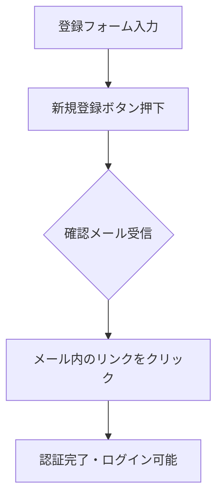

# Animo キャスト用操作マニュアル

このマニュアルでは、キャストの皆様が Animo CMS を使用して日々の業務（出勤確認、シフト提出、ブログ作成等）を行うための手順を解説します。

---

## 1. アカウントの準備

Animoを利用するには、まず自身のアカウントを作成し、メール認証を行う必要があります。

### 1-1. 新規アカウント登録
以下のURLにアクセスし、新規登録フォームに入力してください。

**登録用URL**: `https://club-animo.jp/cast/register`

1. **氏名・源氏名**: 本名と、お店で使用する源氏名を入力します。
2. **携帯番号**: 連絡の取れる電話番号を入力します。
3. **メールアドレス**: 承認用メールが届くアドレスを入力します。
4. **パスワード**: 忘れないように安全なものを設定してください。

### 1-2. メール承認フロー
登録ボタンを押すと、入力したアドレス宛に確認メールが届きます。

> [!IMPORTANT]
> メール内のリンクをクリックして「承認」を完了させないと、ログインすることができません。メールが届かない場合は、迷惑メールフォルダを確認してください。

---

## 2. ログイン方法

認証が完了したら、以下のページからログインしてください。

**ログインURL**: `https://club-animo.jp/cast/login`

- **ID**: 登録したメールアドレス
- **パスワード**: 設定したパスワード

> [!TIP]
> スマートフォンで利用する場合は、ログイン後の画面を「ホーム画面に追加」しておくと、次回からアプリのように簡単に開けます。

---

## 3. ダッシュボードの使い方

ログイン後のメイン画面（ダッシュボード）では、今日やるべきことや最新情報がひと目で分かります。

### 3-1. 本日の優先アクション（ステータス）
画面上部には、以下の項目が未完了の場合にアラートが表示されます。
- **本日の確認**: 出勤前の最終確認。
- **ブログ**: 今日の投稿状況。
- **シフト**: 次回のシフト提出締切。

### 3-2. 主要機能カード
各カードをタップすることで、詳細な機能へアクセスできます。

| 機能名 | 説明 |
| :--- | :--- |
| **本日の確認** | 出勤・退勤の連絡、送りの希望、来店予定（同伴含む）の報告を行います。 |
| **翌週シフト提出** | 次週以降の出勤可能日をカレンダーから提出します。 |
| **今日のブログ** | お客様向けのブログ記事を作成・投稿します。 |
| **今週のスケジュール**| 自身の確定済みシフトを確認できます。 |
| **お知らせ** | 店長や管理者からの大切な連絡を確認します。 |

---

## 4. 日次業務フロー

### 4-1. 本日の確認（Check-in）
出勤前に必ず「本日の確認」を送信してください。
1. **出勤確認**: 「予定通り」「同伴」「休み」から選択。
2. **来店予定**: 予約や同伴のお客様情報を入力。
3. **送信**: 内容を確認して「確認を送信する」ボタンを押します。

> [!CAUTION]
> 提出した内容は店長が承認します。承認されるまでは「店長承認待ち」と表示されます。

### 4-2. ブログ投稿
1. 「ブログを書く」から新規作成。
2. 内容を入力し、公開設定を確認して投稿。
3. 投稿した内容はダッシュボードの履歴から確認・修正が可能です。

---

## 5. シフトの提出

1. 「翌週シフト提出」から該当する週を選択。
2. 各日付の出勤可能時間を入力。
3. **金曜日・土曜日**の充足率を意識して提出しましょう。
4. **提出締切**: 毎週土曜日の 23:55 です。

---

## 6. プロフィール・設定

画面右上のアイコンまたはメニューから、パスワードの変更やプロフィールの更新が可能です。

- **トラブル時**: パスワードを忘れた場合は、ログイン画面の「パスワードを忘れた方」から再設定用リンクを発行してください。
