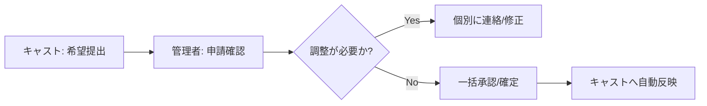

# Animo スタッフ用操作マニュアル

このマニュアルでは、店舗の店長・管理者の皆様が Animo CMS を使用して店舗運営、キャスト管理、コンテンツ更新を行うための手順を解説します。

---

## 1. ログインと基本構造

### 1-1. ログイン
**管理者用ログインURL**: `https://club-animo.jp/admin/login`

- デスクトップでアクセスすると管理画面（PC版）、スマートフォンでアクセスするとモバイル版が自動的に表示されます。
- パスワードを忘れた場合は、ログイン画面下部のリンクから再設定を行ってください。

### 1-2. 管理画面の構成（ナビゲーション）
管理画面は大きく以下の3つのエリアに分かれています。

1. **店舗運営 (Operations)**: 本日の営業状況、予約管理、顧客管理。
2. **人事管理 (Human Resources)**: キャスト管理、求人応募、シフト調整・承認。
3. **コンテンツ・設定 (Marketing/Settings)**: ブログ、ギャラリー、内部通知、システム設定。

---

## 2. ダッシュボードの活用（お店の状態を知る）

ログイン後、最初に表示される「DASHBOARD」では、店舗の主要指標（KPI）をリアルタイムで確認できます。

| 項目 | 内容 | 解説 |
| :--- | :--- | :--- |
| **本日の出勤人数** | 確定/済・未確定 | 今夜の稼働予定人数と、確認が取れていないキャスト数。 |
| **来店予定件数** | 組数 / 人数 | 予約済みの数。昨日比との比較も表示されます。 |
| **シフト未提出** | 要催促人数 | 翌週のシフトをまだ出していないキャストの数。 |
| **体入・応募** | 新着件数 | サイトからの求人応募や、本日予定されている体入者の状況。 |
| **警戒アラート** | 対応が必要な数 | 人員不足のリスクや、未返信の応募がある場合に点灯します。 |

---

## 3. 店舗運営フロー（Daily Ops）

### 3-1. 本日の営業状況 (Today)
「Today」メニューでは、今夜の営業に必要なディテールを管理します。
- **OVERVIEW**: 営業時間、予定人数、予約件数の確認。
- **MANAGEMENT MEMO**:
  - **VIP**: 特別なお客様の対応メモ。
  - **EVENT**: 今夜のイベントやキャンペーンの周知。
  - **要対応**: 遅刻連絡や急な調整が必要な事項。

### 3-2. 顧客・予約管理 (Customers)
来店予定のお客様や、VIP顧客のデータベースを管理します。
- 新規予約の追加・修正。
- 過去の来店履歴の参照。

---

## 4. 人事・シフト管理ワークフロー

スタッフ用管理画面で最も多機能かつ重要なセクションです。

### 4-1. シフト承認サイクル
キャストから提出された希望を元に、確定シフトを作成します。

- **Shifts**: 出勤スケジュールの登録・管理（チェックボックスで一括更新可能）。
- **Template Shifts**: 曜日ごとの標準的なシフトパターンの作成。
- **Shift Requests**: キャストからの個別の変更・欠勤希望の承認。

### 4-2. キャスト・求人管理
- **Human Resources**: 在籍キャストのプロフィール管理。
- **Applications**: サイトからの応募者のステータス（選考中、体験入店、採用等）を管理。

---

## 5. コンテンツ・情報配信 (CMS)

店舗のマーケティング情報を更新します。

### 5-1. 内部通知 (Internal Notices)
キャスト全員、または個別のキャストに向けたメッセージを送信できます。
- キャスト側ダッシュボードに「大切なお知らせ」として表示されます。

### 5-2. サイト更新
- **Gallery / Hero**: 店舗サイトのトップ画像やフォトギャラリーの更新。
- **Posts**: キャストのブログ投稿の監視・管理。
- **Contents**: 店舗情報（アクセス、システム等）の編集。

---

## 6. システム設定

- **Staffs**: 管理画面を利用できるスタッフ（管理者）のアカウント管理。
- **Settings**: 店舗の基本設定、営業時間のデフォルト設定等。
